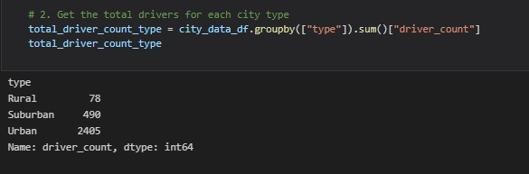
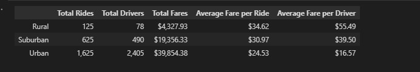
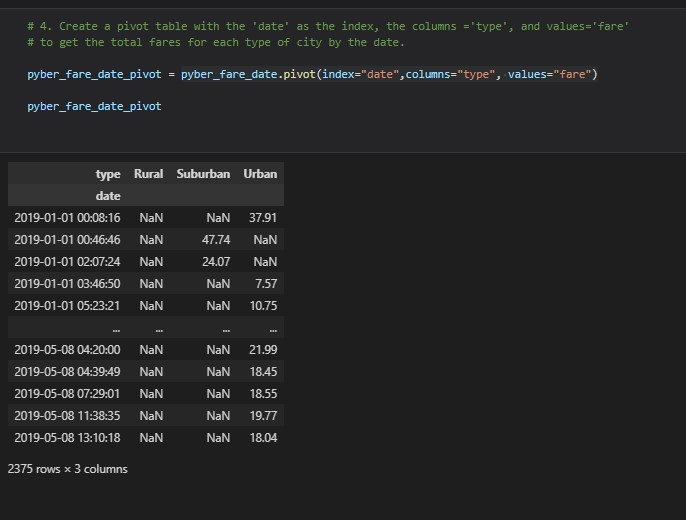
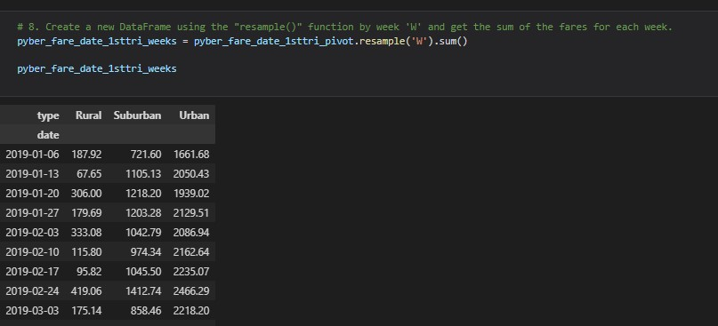
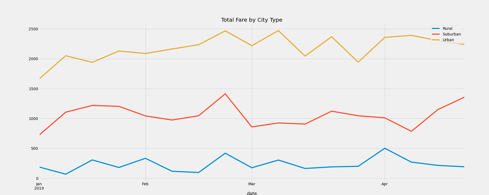

# PyBer_Analysis

## Overview
We have been hired by a ride-sharing app company named PyBer. The company is worth $2.3 billion dollars. Our first assignment is to analyze all of the ride-share data from January to early May of 2019 for the company and create a compelling set of visualizations for our company CEO V. Isualize. These visualizations will help her make decisions about the future direction of the company.

## Overview of data being analyzed

### City data table
The first data set to be analyzed is a table of city data. The data contains the following information:

 - City Name
 - Number of drivers our service has available
 - Type of city, whether Urban, Suburban, or Rural

### Ride data table
The second data set that will be analyzed is a table of rife data. The data contains the following information:

 - City the ride occurred in
 - Date of the ride
 - The fare paid for the ride
 - A ride id

The two data sets will be joined on their city columns to allowed them to be combined for analysis.

## Analysis performed

We will produce a couple of different deliverables for V. Isualize. 

First the data will be analyzed and we will look at the breakdown of data by city type. We will ask the question, does the city type affect the rides and their profitability?

Second we will ask the question, does the number of drivers in an area affect the rides and their profitability?

Lastly, we will take that data and do a time based analysis of it, and produce a visual of fares by city type.

## How does City Type or Number of Drivers Affect Rides and Profitability?

The first thing we needed to do was compute the total driver by city type from the driver table.

Once that metric was calculated, by combining the two data sets on the city type and figuring out the appropriate metrics, our analysis produces a results which looks like:

### Analysis of results

The analysis showed some obvious correlations between city type and the data:

- In Urban cities there are far more drivers available, average fare per driver is low
- In Rural areas there are few drivers available, average fare per driver is much higher
- the distance of the ride make a big difference in fares. In the rural region where rides should be much longer than in the urban areas, the average ride fare is 40+% higher.

## Analysis of the Data by Time

To perform this analysis and produce the visualization for our CEO V. Isualize. we first need to restructure the data. This is a multistep process. The first step is to structure the data into the following format:

<table>
<tr>
<td>Type</td>
<td>Date</td>
<td>Sum(Fare)</td>
</tr>
<tr>
<td>Rural</td>
<td>2019-01-01 9:45:36</td>
<td>43.69</td>
</tr>

</table>

By utilizing the pivot command on the data frame, we can get the data into this format and ready for the next step of the analysis process.
 

Once the data is in the pivot data form, we can utilize the resample function to roll up the data to weekly totals for all three city types.

Once we have the weekly totals for all three city types, we can graph those totals in a line graph for V. Isualize.

 
## Observations from the Analysis

As we look at the results that were generated by the analysis of the ride data a couple of recommendations can be offered to V Isualize.

1) There needs to be a program to raise the demand in the suburban areas. There needs to be a more equal generation of fares between the urban settings and the suburban settings. Currently the urban setting accounts for 68.4% of all the rides, while the suburban setting only accounts for 26.3%. More data is needed to figure out if this a lack of drivers or lack of riders.

2) There is a shortage of drivers in suburban areas. The data clearly shows that there is room to grow the suburban staff.

3)  The company needs to consider dropping rural service. Rural rides account for 5.3% of the total rides of the data analyzed. In the rural cities, roughly 2.6% of the company's drivers work. The total amount of the fares for the data analyzed is 4,327.93. There was not a week in the period of data analyzed where rural rides accounted for a total of fares of more than 500.00.

  
  